# Engineering 4 Notebook


## Table Of Contents

<details>
   <summary> <b> Code Assignments </b> </summary>

<details> <summary>  ☙ Launchpad Assignments </summary>

   * [Launchpad Code 1](https://github.com/lgray52/Engineering4_Notebook#launchpad-1)
   * [Launchpad Code 2](https://github.com/lgray52/Engineering4_Notebook#launchpad-2)
   * [Launchpad Code 3](https://github.com/lgray52/Engineering4_Notebook#launchpad-3)
   * [Launchpad Code 4](https://github.com/lgray52/Engineering4_Notebook#launchpad-4)
   </details>
   
<details> <summary>  ☙ Crash Avoidance Assignments </summary>
   
   * [Crash Avoidance 1](https://github.com/lgray52/Engineering4_Notebook#crash-avoidance-1)
   * [Crash Avoidance 2](https://github.com/lgray52/Engineering4_Notebook#crash-avoidance-2)
   * [Crash Avoidance 3](https://github.com/lgray52/Engineering4_Notebook#crash-avoidance-3)
   * [Crash Avoidance 4](https://github.com/lgray52/Engineering4_Notebook#crash-avoidance-4)
   </details>

<details> <summary> ☙ Landing Area Assignments </summary>
   
  *  [Landing 1](https://github.com/lgray52/Engineering4_Notebook#landing-area-1)
  *  [Landing 2](https://github.com/lgray52/Engineering4_Notebook#landing-area-2)
  *  [Landing 3](https://github.com/lgray52/Engineering4_Notebook#landing-area-3)
   </details>
   
<details> <summary> ☙ Morse Code Assignments </summary>
   
  *  [Morse Code 1](https://github.com/lgray52/Engineering4_Notebook#morse-code-1)
  *  [Morse Code 2](https://github.com/lgray52/Engineering4_Notebook#morse-code-2)
   </details>

</details>

<details> <summary> <b> CAD </b> </summary>
   
   <details> <summary> Launcher Toy Assignments </summary> 
      
   * [4.1 - Ring](https://github.com/lgray52/Engineering4_Notebook#41-ring)
   * [4.2 - Prop](https://github.com/lgray52/Engineering4_Notebook#42-prop)
   </details>

   </details>

## Launchpad 1

### Description & Code
This assignment had you use the serial monitor to print a launch countdown.

[Link to Code](https://github.com/lgray52/Engineering4_Notebook/blob/main/raspberryPi/GrayLaunchpad1.py)

### Evidence


No wiring involved.

### Reflection
A "for" loop is a helpful tool in completing this assignment. A range function also helps, as it gives the "for" loop a number to use for each instance it runs. For example, a "for" loop with a range function from 1 - 10 
```python 
for i in range(1, 10)
```
would assign the variable given (*i* here) to a "for" loop for each number between 1 and 9. So on the first time through the loop *i* would be 1, on the second it would be 2, etc. It only goes up to 9 because on 9 the loop will have run ten times because it includes the first 1. A "for" loop automatically steps by 1, ie adds 1 each time, but you can change that by adding a third parameter to the range function like so,
``` python
for i in range(1, 10, 2)
```
which would change the step to 2. So for this function, on the first time through the loop *i* would be 1, on the second time *i* would be 3, on the third it would be 5, etc. You can ask go backward, or add negative numbers, like in this assignment where I needed to count by -1 from 10 down to 1. 

[Back to Table of Contents](https://github.com/lgray52/Engineering4_Notebook#table-of-contents)


## Launchpad 2

### Description & Code
The purpose of this assignment was to turn on LEDs in correspondence with the countdown. In order to complete this, physical LEDs plugged into the Pico on a breadboard were required. 

[Link to Code](https://github.com/lgray52/Engineering4_Notebook/blob/main/raspberryPi/GrayLaunchpad2.py)

### Evidence


### Wiring
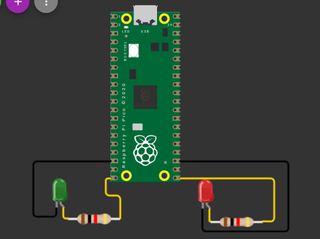

### Reflection
This assignment was a good introduction to infinite "while True" loops, which loop code continuously until it is turned off. It also serves a good intro to connecting LEDs as outputs and the syntax with digitalio required with that. Also, it's very neat that the Pico has 8 grounds (though it's seems a little excessive).

[Back to Table of Contents](https://github.com/lgray52/Engineering4_Notebook#table-of-contents)


## Launchpad 3

### Description & Code
Instead of automatically starting the launch countdown when the code starts running, the purpose of this code was to be able to start the countdown with a button. This required a physical button, but also some understanding of the board and its circuits. 

[Link to Code](https://github.com/lgray52/Engineering4_Notebook/blob/main/raspberryPi/GrayLaunchpad3.py)

### Evidence, including wiring


### Reflection
This assignment introduced buttons, but also the Pico's internal pull up resistors. These are very useful when controlling buttons, as buttons need to be pulled either up or down when they are set up, meaning they either do or don't have complete circuits as their default "off" state. I pulled my button UP, so the circuit is broken when it is in its "off" state, or when it is not pressed. When it is pressed, the circuit is completed and connects to ground, meaning it reads to the board as "False." This is why I use the statement
```python
if button.value == False
```
to check if the button is being pressed. The function is in an infinite "while" loop so it is always checking for the button to be pressed.

[Back to Table of Contents](https://github.com/lgray52/Engineering4_Notebook#table-of-contents)


## Launchpad 4

### Description & Code
The final assignment in the Launchpad series adds the use of a servo motor. I did the spicy version, which begins to move the servo on t = -3s, and completes moving the servo a full 180 degrees at liftoff. 

[Link to Code](https://github.com/lgray52/Engineering4_Notebook/blob/main/raspberryPi/GrayLaunchpad4.py)

### Evidence


### Wiring
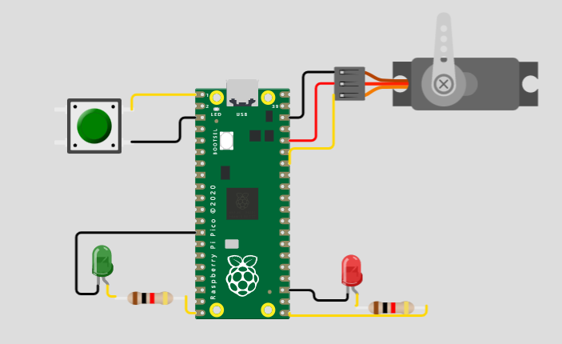

### Reflection
I use several "for" loops to add small increments to the angle of the servo and still achieve the correct amount of time between each blink. In order to achieve that though, I repeatedly switched variable values with each other so that when the loop repeated again, the servo wouldn't be sent back to where it started before. This was a good reminder as to how variables take on values, and how to strategically switch them to store the values of important information to be used by the code in the future. For example, I set the variable "angle_stop" to keep the value of where the angle should stop in the loop, and after the end of every loop, I added the number of degrees I wanted it to go to in the next round. However, I stored the previous value of the angle where the servo stopped in my variable for the current angle, "angle." So between each LED blink, I looped something like this:
```python
"""set to correct stop point"""
angle_stop = angle + 30

"""loop for servo turn"""
for x in range(angle, angle_stop, increment):
   myServo.angle = x
   sleep(time)

"""save where the servo stopped as the current angle"""
angle = angle_stop

"""blink LED"""
led.value = # True or False
```

[Back to Table of Contents](https://github.com/lgray52/Engineering4_Notebook#table-of-contents)

## Crash Avoidance 1

### Description & Code
This assignment introduced the use of an accelerometer/gyroscope, the MPU6050. This is useful for finding the acceleration of the module in the x, y, and z directions as well as the angular velocity. 

[Link to Code](https://github.com/lgray52/Engineering4_Notebook/blob/main/raspberryPi/grayCrash1.py)

### Evidence


### Wiring
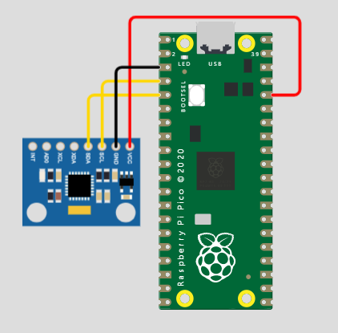

### Reflection
The accelerometer stores the x, y, and z acceleration values in a fancy list called a tuple. Pieces of a tuple can be accessed in the same manner as pieces of a list, meaning that you have to index each value. Indexing means refering to a value in a list by its numerical value in the list - the tricky thing about indexing is it starts counting from 0. So term 1 in the list would be 0, and term 2 would be 1, etc. For the tuple, this means that in order to pull the y-value, for example, you'd have to extract the second term by indexing [1]. The use of an f-string was also very cool, because it makes a string look waaayyyyy nicer than printing strings and variables in the normal way with them separtated by commas, which leaves weird little spaces between words and numbers. 

[Back to Table of Contents](https://github.com/lgray52/Engineering4_Notebook#table-of-contents)


## Crash Avoidance 2

### Description & Code
This assignment had the Pico activate a warning light when the sensor is tipped to 90 degrees, using the property of acceleration due to gravity. 

[Link to Code](https://github.com/lgray52/Engineering4_Notebook/blob/main/raspberryPi/grayCrash2.py)

### Evidence


### Wiring
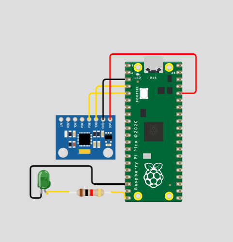

### Reflection
The additional coding for this assignment was minimal, simply adding an if statement checking whether or not the accelerometer was experiencing a downwards z acceleration or not (as z-acceleration approached 0). Because gravity provides a constant acceleration of 9.8 $m/s^2$, when the accelerometer is right-side up, the z acceleration is 9.8, whereas when its tipped on its side the acceleration is around zero. Since the accelerometer is not perfectly sensitive, I had the warning light turn on when the acceleration was less than or equal to one since that was about what I was getting when I put the sensor on its side. 

[Back to Table of Contents](https://github.com/lgray52/Engineering4_Notebook#table-of-contents)


## Crash Avoidance 3

### Description & Code
The purpose of this assignment was to print values for the angular acceleration to an OLED screen. This made use of the gyroscope feature of the accelerometer to measure angular acceleration.

[Link to Code](https://github.com/lgray52/Engineering4_Notebook/blob/main/raspberryPi/grayCrash3.py)

### Evidence


### Wiring
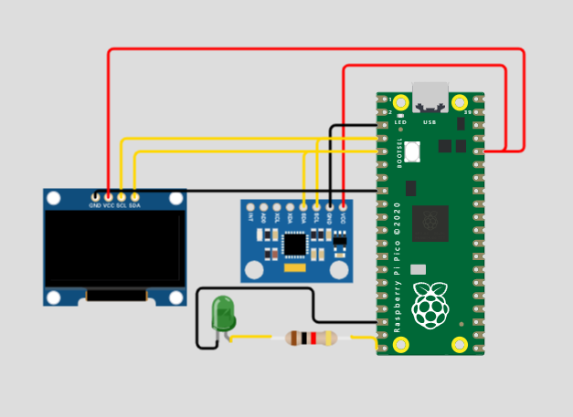

### Reflection
Printing things to the screen was kind of trial and error - figuring out the positioning using the coordinate system took some messing around with. Ultimately, I decided that spacing lines at 10 apart in the y direction looked the best. Another useful little note is that you have to "append" each individual line to the splash group separately (append-ing something means adding a term to a list, in this case adding a line of text to the splash to give it information to display on the screen).

[Back to Table of Contents](https://github.com/lgray52/Engineering4_Notebook#table-of-contents)


## Crash Avoidance 4

### Description & Code
The purpose of this (spicy) assignment was to deactivate the tilt warning light when a certain safe altitude is reached. By using values from the altimeter and conditional statements, this is relatively straight forward to accomplish. 

[Link to Code](https://github.com/lgray52/Engineering4_Notebook/blob/main/raspberryPi/grayCrash4.py)

### Evidence


### Wiring
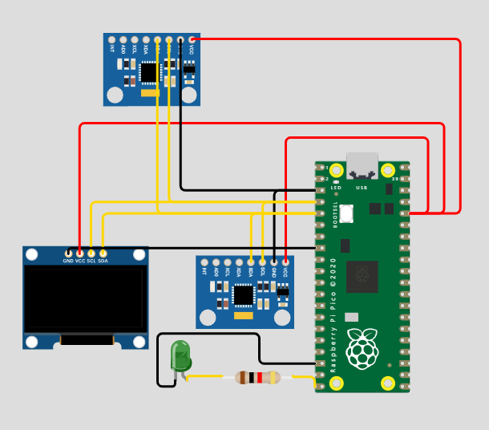
**Note:** the altimeter is represented here as an MPU because no diagram of the altimeter exists on the wiring diagram site. The wiring is the same - SCL and SDA pins go to pins on the board, and power and ground connect to their respective pins. 

### Reflection
Using an altimeter is a useful step towards the pi in the sky project, as it allows measuring the distance above ground. One important thing to keep in mind with this sensor is that it needed to be essentially calibrated by allowing the sensor to read what ground level is before lifting it off the ground, since the sensor uses pressure to measure distance relative to sea level. Unless you happen to be exactly at sea level, the altitude given will simply reflect height with respect to sea level rather than to the ground, so to measure height from the ground I included value definition for base ground level before entering the loop, where I check the current altitude each time it runs. This allowed me to subtract ground level from the current altitude to find the altitude of the sensor relative to the ground. 

[Back to Table of Contents](https://github.com/lgray52/Engineering4_Notebook#table-of-contents)


## Landing Area 1

### Description & Code
The purpose of this assignment was to use functions to calculate the area of a triangle given it's vertices. I created a library for the functions involved and imported them to the main script.

[Link to Code](https://github.com/lgray52/Engineering4_Notebook/blob/main/raspberryPi/grayLanding1.py)

[Link to Library for Functions](https://github.com/lgray52/Engineering4_Notebook/blob/main/raspberryPi/grayLandingLib1.py)

### Evidence


*No wiring was involved.*

### Reflection
This assignment was a good introduction to functions. I put my functions into a library then imported them to the file. I definitely could have done the area of a triangle calculation in a much more simple way, but before I realised that I had already made a matrix, so I just used the determinant of the matrix to find the area. One important thing this assignment introduced was the try and except loop. The syntax of this loop is a little confusing, but its a little simpler if you think of it as an error scanner. If what's in the "try" loop doesn't produce an error, the code continues without entering the "except" loop. But, if the "try" loop creates an error, like being unable to convert a letter to a number in the context of this assignment, the function enters the "except" and does that instead. This is useful for prompting a correct input if the user inputs something in the incorrect formatting. 

[Back to Table of Contents](https://github.com/lgray52/Engineering4_Notebook#table-of-contents)


## Landing Area 2

### Description & Code
This assignment used an LED screen to show where the triangular landing area is with respect to the base. 

[Link to Code](https://github.com/lgray52/Engineering4_Notebook/blob/main/raspberryPi/grayLanding2.py)

[Link to Function Library](https://github.com/lgray52/Engineering4_Notebook/blob/main/raspberryPi/grayLandingLib2.py)

### Evidence


### Wiring
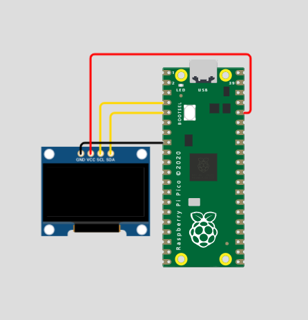

### Reflection
The main kicker with this assignment was really just remembering all the libraries you need because the OLED screen needs so. many. libraries. But after that, it was important to remember how the coordinate system works with the screen. Because the center, which I made the origin, is located at (64, 32), and because the y-axis counts up as you go down the screen, you need to add adjustments to the received vertices. In order to count from the origin, you need to add 64 to the x coordinates, and in order to adjust for the position of the origin, you need to subtract the y-coordinate from 32. The y-coordinate is a little stranger, but in order to get a point above the middle of the screen where the y-value is 32, you need a smaller number. So, the regular coordinate needs to be subtracted from 32. 

[Back to Table of Contents](https://github.com/lgray52/Engineering4_Notebook#table-of-contents)


## Landing Area 3

### Description & Code
This spicy assignment was to take a list of triangles, print a visualisation of each one to the OLED, and find the closest one with an area greater than 100 square kilometers. I used several aspects of lists and indexing to achieve this. 

[Link to Code](https://github.com/lgray52/Engineering4_Notebook/blob/main/raspberryPi/grayLanding3.py)

[Link to Library](https://github.com/lgray52/Engineering4_Notebook/blob/main/raspberryPi/grayLandingLib3.py)

### Evidence
**Test case 1:** 


**Test Case 2:**


### Wiring

*Same as Landing 2*

### Reflection
I used a lot of "for" loops in this code to cycle through each of the triangles in the list. I also used indexing within "for" loops a bunch. One thing I forgot about indexing is that in order to pull an item from a list within a list, the syntax is
``` python
nums[i][j]
```
not
``` python
nums[i, j]
```
That little fact caused a LOT of confusion. Most of the rest of anything confusing is in my comments.

[Back to Table of Contents](https://github.com/lgray52/Engineering4_Notebook#table-of-contents)


## Morse Code 1

### Description & Code
This code uses a morse code dictionary to translate text into morse code. It required that the code exit if a user enters "-q" when prompted to enter something to translate. No wiring was needed for this assignment.

[Link to Code](https://github.com/lgray52/Engineering4_Notebook/blob/main/raspberryPi/grayMorseCode1.py)

### Evidence


### Reflection
This assignment was pretty straightforward. The use of the 
``` python
for letter in message
```
is pretty nifty, because it makes taking each letter in the text to translate and then referring to that same letter in the loop super easy. The one thing that tripped me up was checking for the quit statement using an if statement - I forgot that it would be formatted as a list and spent a good deal of time trying to figure out the problem before using a print statement in the relevant if statement to check if it was ever entering the loop. Print statements were very useful for identifying check points throughout this assignment. 

[Back to Table of Contents](https://github.com/lgray52/Engineering4_Notebook#table-of-contents)


## Morse Code 2

### Description & Code
This assignment extends the translation of morse code into transmission by blinking an LED. The length of the blink for a dash has to be three times longer than a dot. 

[Link to Code](https://github.com/lgray52/Engineering4_Notebook/blob/main/raspberryPi/grayMorseCode2.py)

### Evidence


### Wiring
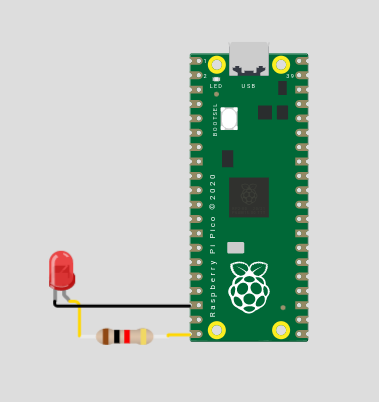

### Reflection
This assignment was a good extension of the first one. I did have to modify my original code a little bit to store the full message in morse code, but other than that, this assignment basically just added a couple if statements. The "for character in message" loop also comes in very handy here for going through each of the characters and blinking a certain length of time for each different character. 

[Back to Table of Contents](https://github.com/lgray52/Engineering4_Notebook#table-of-contents)

   
## 4.1 Ring

### Description
I was student A for this assignment, so I made the ring. The ring attaches to the top where the key is pulled. I am working with [Cole](https://github.com/cneal05) on this assignment set.

### Evidence
[OnShape Document](https://cvilleschools.onshape.com/documents/bd4a30d821e22581a9b814bb/w/3924901670c70451ae4c5c93/e/11fb20d534141111f8cc663c)

### Images
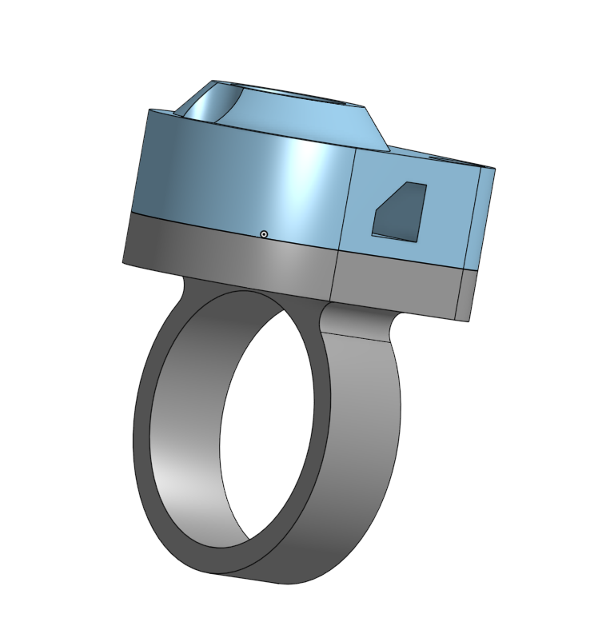 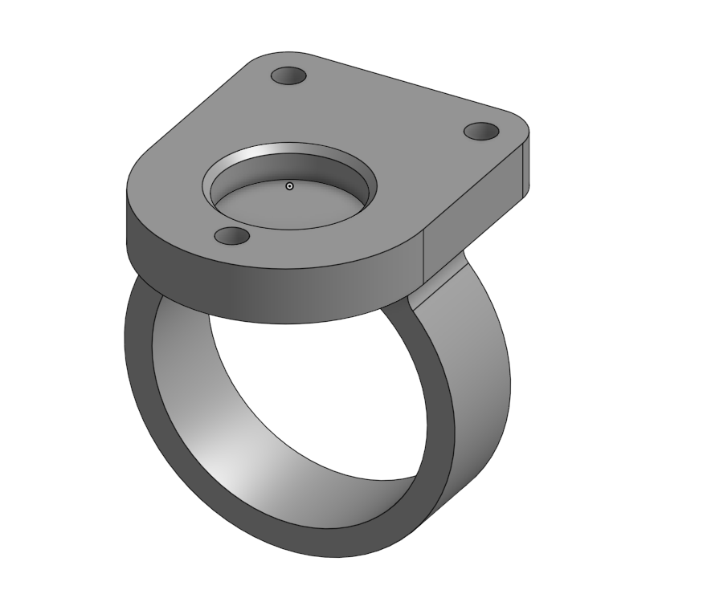 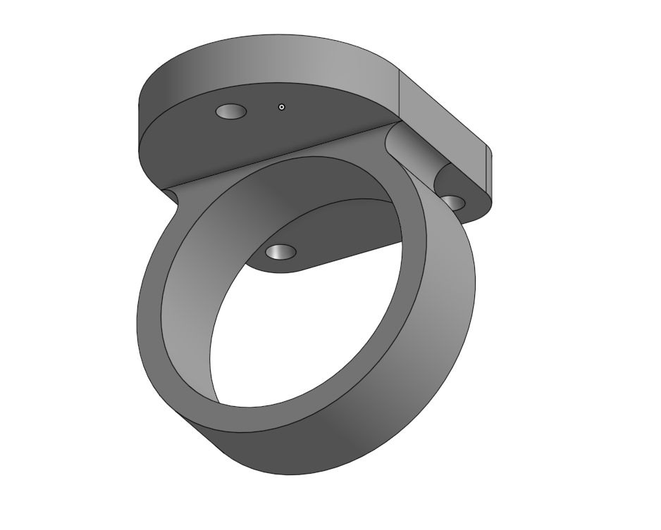

### Reflection
This assignment was quite simple. The use feature (keyboard shortcut "u") is helpful to make use of existing geometry. Another useful keyboard shortcut is "w," which allows you to zoom in to the window you select when you activate the shortcut. This assignment also made use of several planes to create intersecting pieces.

[Back to Table of Contents](https://github.com/lgray52/Engineering4_Notebook#table-of-contents)


## 4.2 Prop

### Description
The prop is the little helicopter-type toy that is launched, bey-blade style, from the spinner. Cole and I switched, so I am Student B on this assignment. 

### Evidence
[OnShape Document](https://cvilleschools.onshape.com/documents/bd4a30d821e22581a9b814bb/w/3924901670c70451ae4c5c93/e/518d02f43562175bce0a04ea?renderMode=0&uiState=635817af8760e45d1e2e6835)

### Images
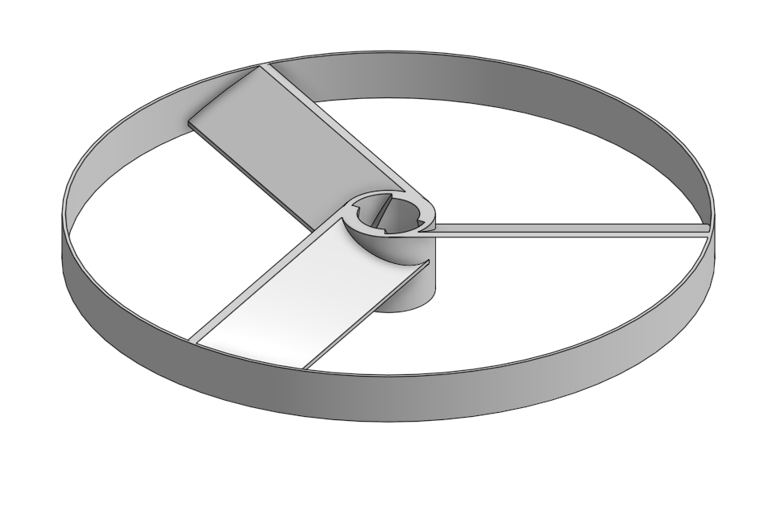 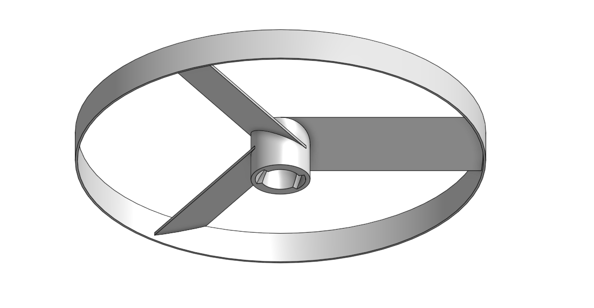

### Reflection
This assignment started by making two separate parts from the same sketch. They are then combined with the blades, and merged into one part. This is an interesting way of approaching part design, especially because I never realised that two parts could be combined by connecting them after they have already been created as separate parts. The sweep feature, used in cutting out the channel for the spinner, is a useful tool, allowing you to cut out something along a curve. 

[Back to Table of Contents](https://github.com/lgray52/Engineering4_Notebook#table-of-contents)
