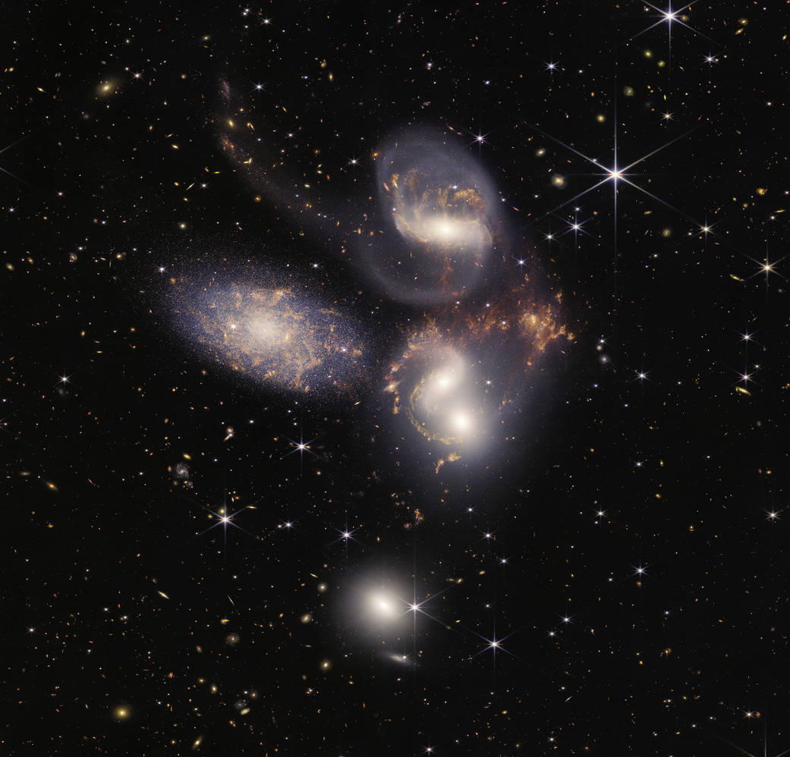

# Engineering4_Notebook


## TableOfContents
* [Launchpad Code 1](#Launchpad1)
* [Media Test](#MediaTest)

## Launchpad1

### Description & Code
This assignment had you use the serial monitor to print a launch countdown.
[Link to Code](https://github.com/lgray52/Engineering4_Notebook/blob/main/raspberryPi/GrayLaunchpad1.py)

### Evidence


No wiring involved.

### Reflection
A for loop is a helpful tool in completing this assignment. A range function also helps, as it gives the for loop a number to use for each instance it runs. For example, a for loop with a range function from 1 - 10 
```python 
for i in range(1, 10)
```
would assign the variable (*i* here) given to a for loop for each number between 1 and 9. So on the first time through the loop *i* would be one, on the second it would be 2, etc. It only goes up to 9 because on 9 the loop will have run ten times because it includes the first 1. A for loop automatically steps by 1, ie adds 1 each time, but you can change that by adding a third parameter to the range function like so,
``` python
for i in range(1, 11, 2)
```
which would change the step to 2. So for this function, on the first time through the loop *i* would be 1, on the second time *i* would be 3, on the third it would be 5, etc. You can ask go backward, or add negative numbers, like in this assignment where I needed to count by -1 from 10 down to 1. 

[Back to Table of Contents](#Table_of_Contents)

## MediaTest

### Test Link
[link test](https://www.webhamster.com/)

### Code Link
[code link](https://github.com/lgray52/Engineering4_Notebook/blob/main/raspberryPi/test.py)

### Test Image


### Test GIF


[Back to Table of Contents](#TableOfContents)
